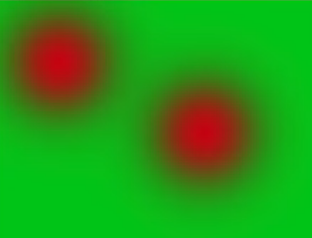

This post will explain what is a radial basis function neural networks - or RBF Nets - in  a bullet style.

## RBF Networks

- RBF networks are a special kind of neural networks which is used for classification and interpolation.

- RBFs are conceptually similar to k-Nearest neighbor models.

- They model the data in terms of circles or spheres (Radial shape).

- What if we can't divide the data into radials?

  - The network will learn to do intersected circles even with smallest size to cover the area you want.

- Actually the circles that RBF detects has smooth transitions not hard ones to make the algorithm work better and to give us how confident we are about the result.

  - 
  - It Makes training easier.
  - Training time are less.
  - The drop off curve (Smooth transitions) have many shapes, its so important to choose the best one.

- Radial basis function (The heart of RBFs) Also called the **<u>kernel function</u>**

  - Something that drops off as further you are going away.
  - As the distance increases it decreases
  - It can be:
    - `1/D`
    - `e^(-D)`
    - `1/D^2`
    - `e^(-D^2)`			`#Used alot`			
  - Where `D` is the distance between the center of the circle and the current point you are in.

- How we get circles of different sizes?

  - We add an argument beta where:
    - `e^(-beta * D^2)`
  - The beta helps shaping the size of the circle and its a learnable parameter. It controls the radius.

- First layer of the network:

  - ```
       /--C1-------->e^(-beta1 * (x-c1)^2)
      /---C2-------->e^(-beta2 * (x-c2)^2)
    X 
      \---C3-------->e^(-beta3 * (x-c3)^2)
       \--C4-------->e^(-beta4 * (x-c4)^2)
    ```

  - We learn `C1` & `beta1` (We can deal with  `C1` as weights and `beta1` as bias)

- Each neuron in the hidden layer consists of a radial basis function.

- The next layer can be a linear classier like Softmax or SVMs. It has a weighted sum of outputs from the hidden layer to form network outputs.

- The RPF can be trained with Back prob or K-means clustering algorithm.

- Currently we cant train deep RPF networks efficiently and its an active area of research.

- RPF are more secure to adversarial neural networks attacks.


<br/>

<br/>

## References

- https://www.youtube.com/watch?v=1Cw45yNm6VA
- https://www.youtube.com/watch?v=OUtTI99uRf4

<br/>

<br/>