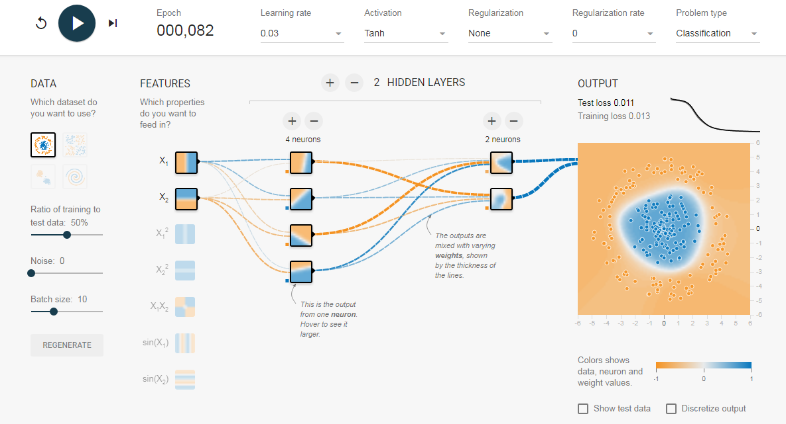

[Tensorflow](https://www.tensorflow.org) is the most popular deep learning framework out there. It has a lot of features, functions, and tools. Among the tool there are a tool called [Tensorflow playground](http://playground.tensorflow.org).

## Tensorflow playground

- Deep playground is an interactive visualization of neural networks, written in typescript using d3.js. 
- Its fun to see how NNs work in your browser.
- 
- Site link: http://playground.tensorflow.org
- It can also be deployed locally on a machine that contains python and tensorflow to add more samples as you desire.

 

 

## References

- http://playground.tensorflow.org
- https://www.tensorflow.org
- https://github.com/tensorflow/tensorflow

 

 

