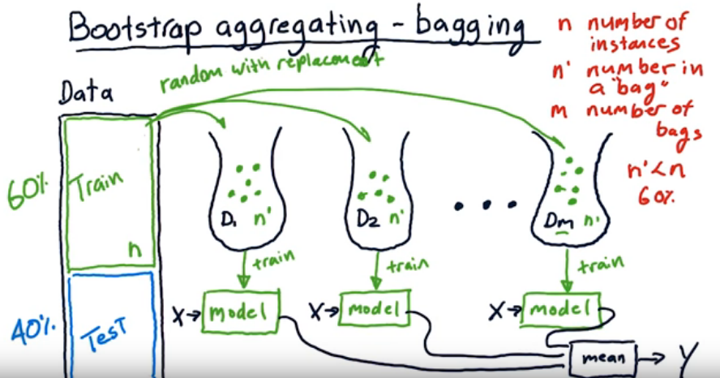

Bagging - sometimes is called **<u>bootstrap aggregating</u>**- is one of the machine learning ensembling methods. Its used to reduce model overfitting to data or we can say to reduce high variance given a model. Usually the model represents a classification or regression problem.

Here are the Wikipedia definition:

> Bagging, is a machine learning ensemble meta-algorithm designed to improve the stability and accuracy of machine learning algorithms used in statistical classification and regression. It also reduces variance and helps to avoid overfitting. Although it is usually applied to decision tree methods, it can be used with any type of method. Bagging is a special case of the model averaging approach.

 

This picture from this [video](https://www.youtube.com/watch?v=2Mg8QD0F1dQ) explains how it works.

First we take random bags `D1, D2, ..` from the training set where each bag has to contain at least 60% of the training set size. 60% is a hyperparameter here. We take random samples with replacement which means we can have repeated data here.

Once we have the bags we train each of the bags on a model Independently. Then on testing time, we take the average of all the output of each model we have trained.  

 

## References

- https://en.wikipedia.org/wiki/Bootstrap_aggregating
- https://www.youtube.com/watch?v=2Mg8QD0F1dQ

 